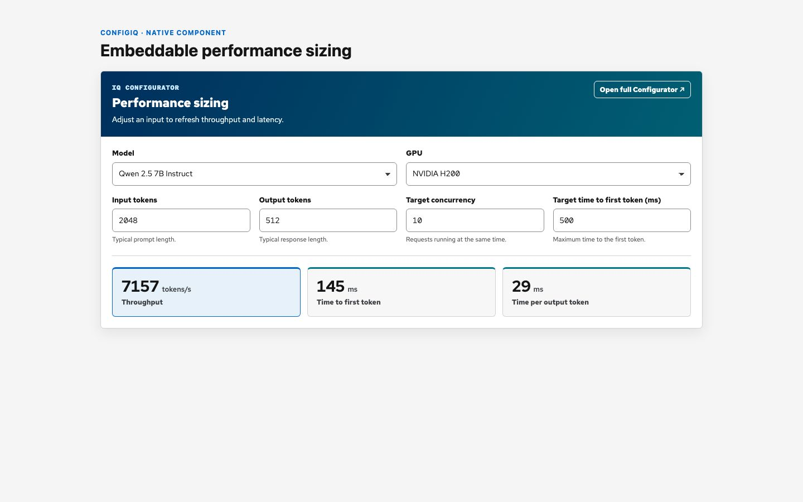
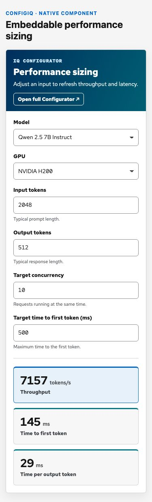
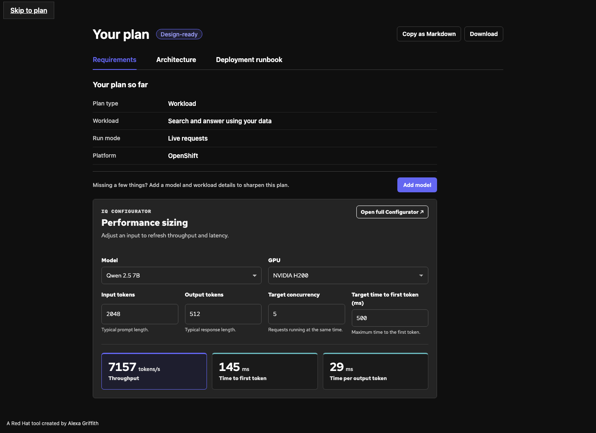
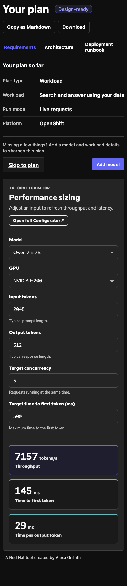
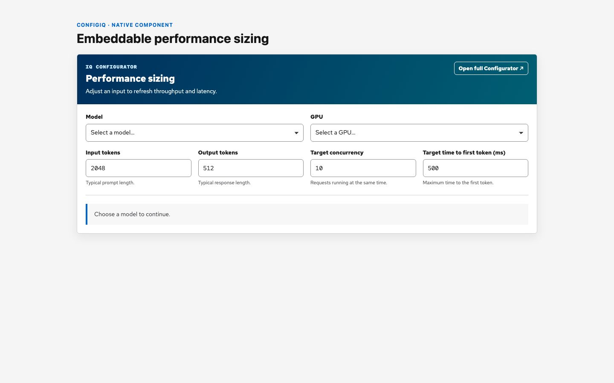
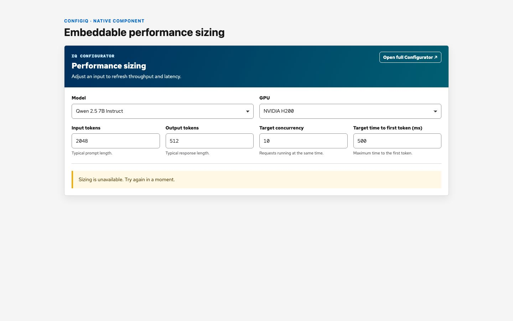

# Embeddable sizing widget

The ConfigIQ sizing widget adds performance sizing to any web page. The
framework-independent custom element currently collects six inputs and displays
throughput, time to first token (TTFT), and time per output token (TPOT) from
ConfigIQ.

## Quick start

Load the component from your ConfigIQ deployment, add it to the page, and pass
its model and GPU options through the `config` property.

```html
<configiq-sizing-widget
  id="sizing"
  endpoint="/api/configiq"
  timeout-ms="27000"
  heading-level="2"
  theme="dark"
  full-label="Open full ConfigIQ"
></configiq-sizing-widget>

<script type="module">
  const configiqOrigin = 'https://configiq.xyz';
  await import(new URL('/widgets/configiq-sizing-widget-v1.js', configiqOrigin));

  const widget = document.querySelector('#sizing');
  widget.setAttribute(
    'full-url',
    new URL('/performance', configiqOrigin).href,
  );
  widget.config = {
    models: [
      {
        value: 'qwen-2.5-7b',
        label: 'Qwen 2.5 7B',
        modelPath: 'Qwen/Qwen2.5-7B-Instruct',
      },
    ],
    gpus: [
      { value: 'h200', label: 'NVIDIA H200', system: 'h200_sxm' },
    ],
    seed: {
      model: 'qwen-2.5-7b',
      gpu: 'h200',
      isl: 2048,
      osl: 512,
      concurrency: 10,
      ttft: 500,
    },
  };
</script>
```

Set `configiqOrigin` to the deployment that serves the component. The same
origin can provide the optional link to the full ConfigIQ performance workflow.

## Configuration

| Setting | Purpose |
| --- | --- |
| `config.models` | Model labels, host identifiers, and ConfigIQ `model_path` values |
| `config.gpus` | GPU labels, host identifiers, and ConfigIQ `system` values |
| `config.seed` | Initial model, GPU, token, concurrency, and TTFT values |
| `endpoint` | Recommendation endpoint or same-origin server proxy |
| `timeout-ms` | Request timeout in milliseconds; the default is 95 seconds |
| `heading-level` | Heading level from `1` through `6`; the default is `2` |
| `theme` | Omit for the native light theme or set to `dark` |
| `full-url` | Optional HTTP(S) link to the full performance workflow |
| `full-label` | Optional label for the full-workflow link |

The host maps its catalog identifiers to the `modelPath` and `system` values
that ConfigIQ accepts. The widget handles validation, requests, status updates,
results, and responsive presentation.

When `full-url` is present, the widget keeps its `model` and `system` query
parameters aligned with the current selections. The `/performance` page reads
valid parameters and uses its catalog defaults for missing values.

## Endpoint contract

By default, the widget sends `POST /api/recommend`. Set `endpoint` when the page
uses a same-origin server proxy.

```json
{
  "model_path": "Qwen/Qwen2.5-7B-Instruct",
  "system": "h200_sxm",
  "isl": 2048,
  "osl": 512,
  "ttft": 500,
  "target_concurrency": 10
}
```

The endpoint can return the ConfigIQ response directly or wrap it as
`{ "ok": true, "data": <ConfigIQ response> }`. The widget displays finite,
non-negative values from these fields:

- `throughput.tokensPerSecond`
- `performance.ttftLatencyMs`
- `performance.tpotMs`

The widget displays only values returned by ConfigIQ. An incomplete or failed
response produces an unavailable state.

## Runtime behavior

- Requests start 500 milliseconds after the last edit.
- A new edit cancels the previous request and ignores late responses.
- Token, concurrency, and latency fields accept positive integers.
- Reassigning an equivalent `config` object preserves in-progress edits.
- Changing the catalog or seed resets the fields to the new configuration.
- The versioned component URL provides backward-compatible updates for V1.

## Styling

The component uses an open shadow root to isolate its layout and styles. The
default theme matches ConfigIQ. Set `theme="dark"` for dark surfaces.

Common supported properties include:

- `--configiq-widget-surface`
- `--configiq-widget-surface-subtle`
- `--configiq-widget-text`
- `--configiq-widget-text-muted`
- `--configiq-widget-border`
- `--configiq-widget-accent`

Use the `--configiq-widget-*` properties defined in the component as the
supported styling API. The component retains its spacing, hierarchy, behavior,
and accessible states across host themes.

## Visual examples

### Native theme





### Dark host theme





### Empty and unavailable states





## Test

Run the component contract and lifecycle tests:

```bash
npm test -- tests/widgets/configiq-sizing-widget.test.mjs
```

The tests cover request mapping, response validation, incomplete and error
states, stale requests, accessibility, configuration updates, and full-workflow
links.

See the [developer guide](./embeddable-sizing-widget-development.md) for
component maintenance, compatibility, and visual-review checks.
